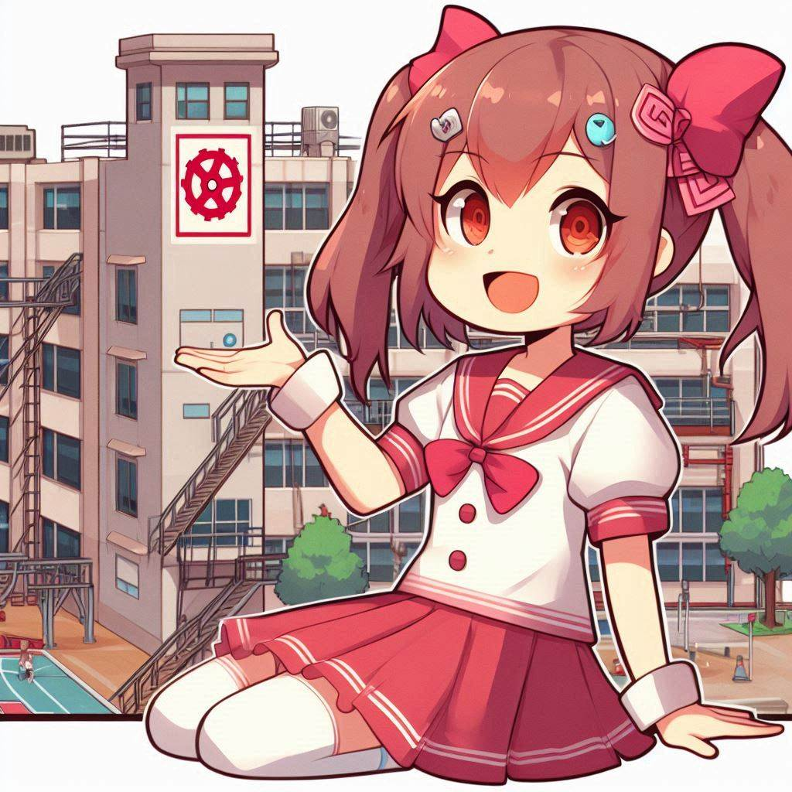

# renpy_parser_rs

[](https://crates.io/crates/renpy_parser)
[](https://github.com/bevyengine/bevy#license)
[](https://crates.io/crates/renpy_parser)




Ren'Py Scenario File Parser in Rust (translated from Ren'Py's parser.py)

This parser handles a subset of the Ren'Py scripting language, excluding support for variables, expressions, and Python code.

Renpy operators (renpy semantics): 
```rpy
hide, init, jump, return, scene, show, stop
```

Additional operators: 
```rpy
game_mechanic "card play"
lm_generate character "instruction"
```

## Usage 

See [examples/script.rs](examples/script.rs) for a complete example.

Turns 

```rpy
define character_1 = Character("Character 1", color="#000000")
define character_2 = Character("Character 2", color="#ffaabb")

label start:
    jump chapter1_1

label chapter1_1:

    scene background

    "I've always loved visual novels"

    play music "Truth.mp3"

    show character komarito

    character_1 "Bevy seems like the perfect choice for this project"

    stop music

    character_1 "I'm planning on using Rust as my programming language"

    play music "Calamity.wav"

    character_1 "It's a bit intimidating, but I'm up for the challenge"

    scene city road anime

    play sound "applause.wav"

    "I've already started working on some basic components"

    show character igor

    character_2 "But I need to make sure they're stable and bug-free first"

    character_2 "Wish you were here to help me brainstorm"

    stop music fadeout 5.9

    character_2 "Thanks for listening, even if it's just a voice in my head!"

    game_mechanic "card play"

    llm_generate ai "You are narrator in a visual novel. Player just player poker and got {} combinations. Score is {}. Comment result sarcasically!"
    llm_generate ai

    return
```

into

```rpy
ast: Define(1, "character_1 = Character(\"Character 1\", color=\"#000000\")")
ast: Define(2, "character_2 = Character(\"Character 2\", color=\"#ffaabb\")")
ast: Label(4, "start", [Jump(5, "chapter1_1", false)], None)
ast: Label(7, "chapter1_1", [
    Scene(9, Some("background"), "master"), 
    Say(11, None, "I've always loved visual novels"), 
    Play(13, "music", "Truth.mp3"), 
    Show(15, "character komarito"), 
    Say(17, Some("character_1"), "Bevy seems like the perfect choice for this project"), 
    Stop(19, "music", None, None), 
    Say(21, Some("character_1"), "I'm planning on using Rust as my programming language"), 
    Play(23, "music", "Calamity.wav"), 
    Say(25, Some("character_1"), "It's a bit intimidating, but I'm up for the challenge"), 
    Scene(27, Some("city road anime"), "master"), 
    Play(29, "sound", "applause.wav"), 
    Say(31, None, "I've already started working on some basic components"), 
    Show(33, "character igor"), 
    Say(35, Some("character_2"), "But I need to make sure they're stable and bug-free first"), 
    Say(37, Some("character_2"), "Wish you were here to help me brainstorm"), 
    Stop(39, "music", Some("fadeout"), Some(5.9)), 
    Say(41, Some("character_2"), "Thanks for listening, even if it's just a voice in my head!"), 
    GameMechanic(43, "card play"), 
    LLMGenerate(45, "ai", Some("You are narrator in a visual novel. Player just played poker with youand lost. What do you say?")), 
    LLMGenerate(46, "ai", None), Return(48, Some(""))
], None)

```